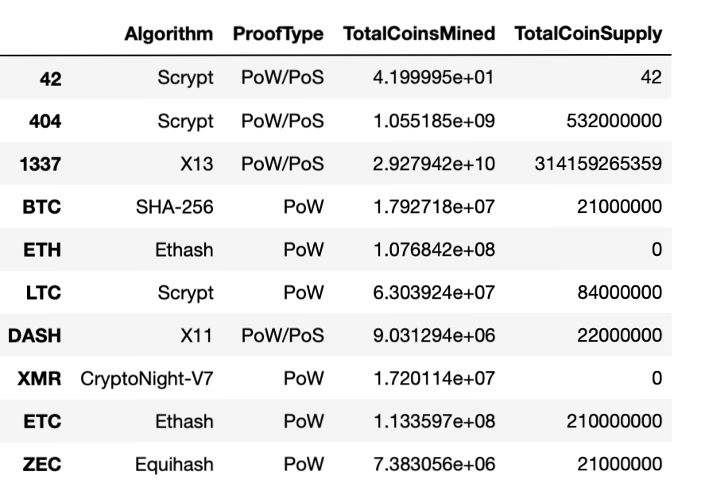
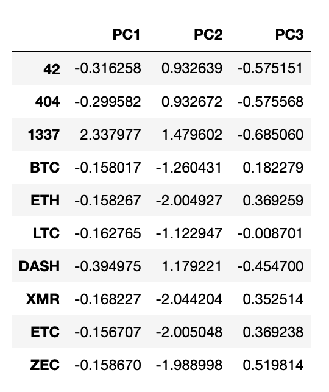
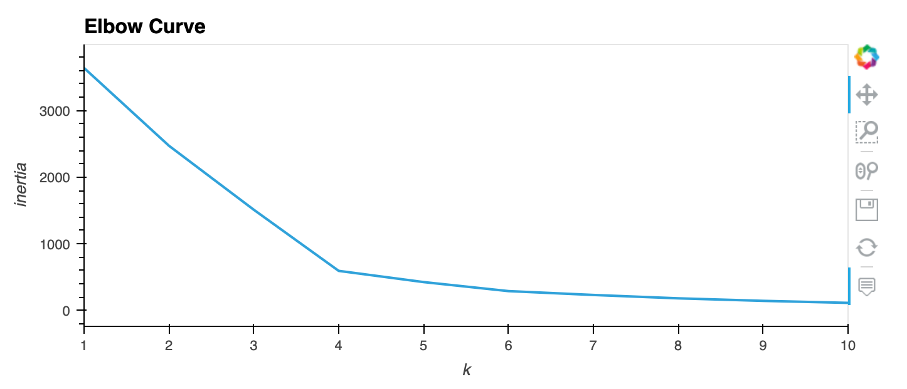
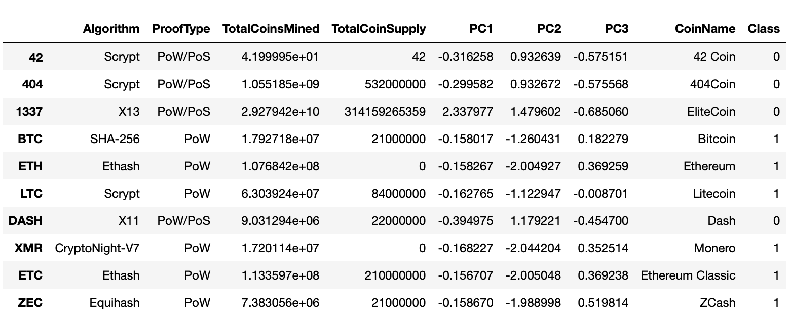
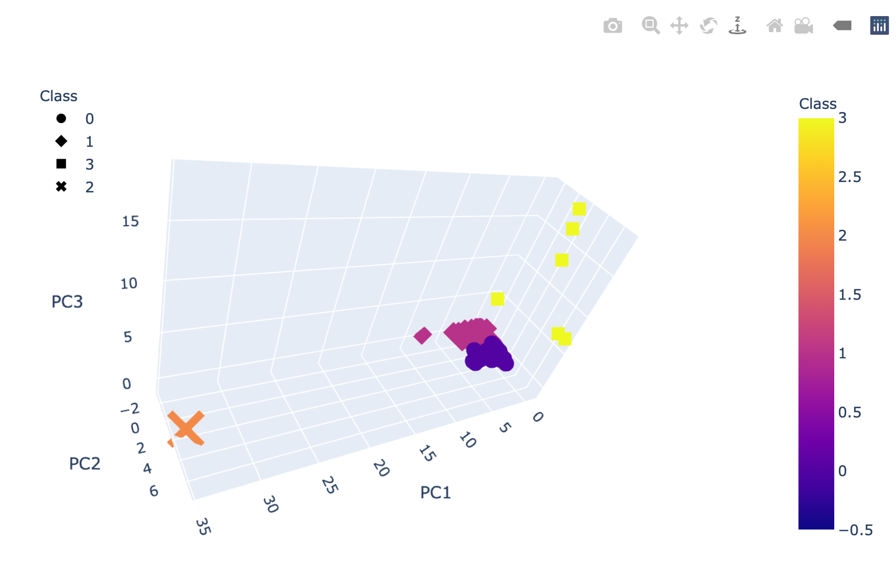
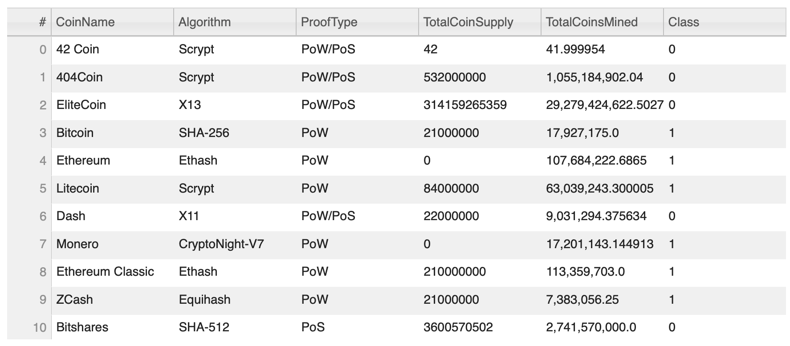
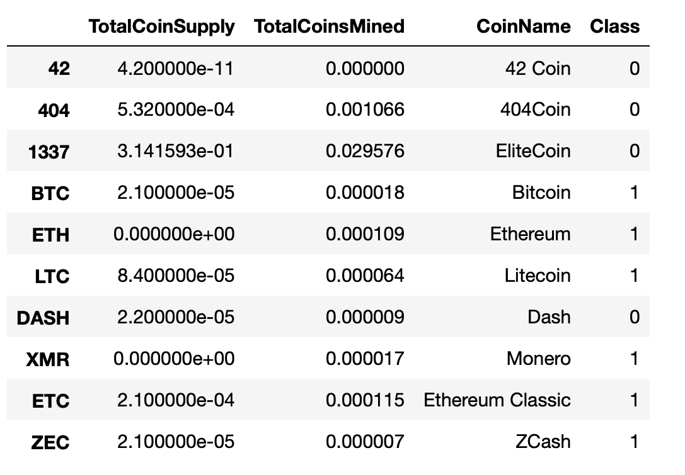
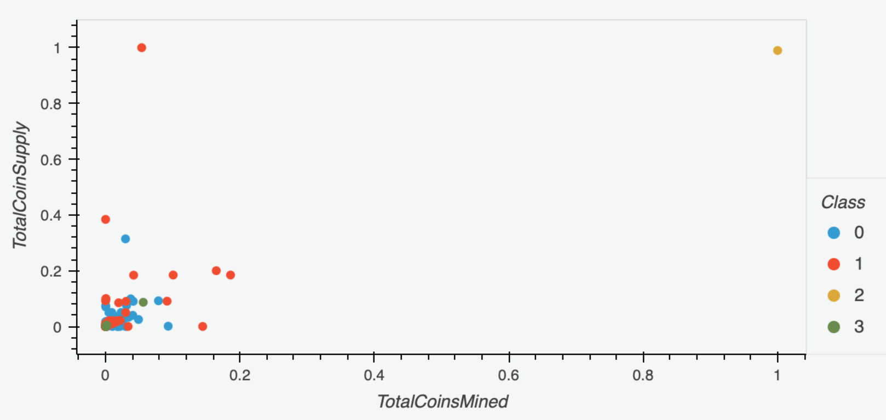

# Cyptocurrencies
Use skills associated with unsupervised learning to create an analysis for clients who are preparing to get into the cryptocurrency market.

# Overview of Analysis
Preprocessing the database, reducing the data dimension using Principal Component Analysis or PCA, clustering cryptocurrencies using K-Means AND visualizing classification results with 2D and 3D scatter plots are skills associated with unsupervised learning; In this project we are given the task to analyze a database of cryptocurrencies using the skills mentioned above to create a report that includes what cryptocurrencies are on the trading market and how they could be grouped to create a classification system for this new investment.

## Preprocessing the Data for Principal Component Analysis or PCA
The original dataset had 1252 cryptocurrencies or rows and 6 columns, we were able to reduce this to 532 cryptocurrencies or rows and 4 columns. This was accomplished by removing rows with cryptocurrencies that were not being traded, that have at least one null and that do not have coins being mined. We took out or dropped the IsTrading and the CoimName columns as well. 

## Reducing Data Dimensions Using Principal Component Analysis or PCA
Principal Component Analysis or PCA was utilized to reduce the dimensions to three principal components; A new DataFrame with PC 1, PC 2, and PC 3 as columns was created.

## Clustering Cryptocurrencies Using K-means
Using the new DataFrame produced using PCA, an elbow curve using hvPlot to find the best value for K was created using the K-Means method iterating on k values from 1 to 10. Based on the elbow curve, the best k value appears to be 4 so we would conclude on an output of 4 clusters to categorize the crytocurrencies. 

A DataFrame that included predicted clusters and cryptocurrencies features was created after the elbow-curve. It has the following columns: Algorithm, ProofType, TotalCoinsMined, TotalCoinSupply, PC 1, PC 2, PC 3, CoinName, and Class. In this case, class would pertain or correspond to the prediction, in terms of what cluster the cryptocurrency belongs to.

## Visualizing Cryptocurrencies Results

### 3D scatter plot with clusters

This 3-D scatter plot was generated using the PCA algorithm to reduce the crytocurrency dimensions to three principal components. 

### Tradable Cryptocurrencies Table

Majority of the cryptocurrencies are part of class #0 and #1 and only one fell under class 2. This was also observed on the array of predictions generated prior to creating this DataFrame. 

### Table for TotalCoinMined and TotalCoin Supply

A DataFrame was then created with just the following four columns: TotalCoinSupply, TotalCoinsMined, CoinName and Class.

### 2D-Scatter plot with TotalCoinMined vs TotalCoinSupply

It is difficult to distinguish the cryptocurrencies and the different classes from this scatterplot with the two cryptocurrency features because a lot of the data points are overlapping. Using the PCA algorithm might be the better method for visualizations. 

# Summary
From 1252, we were able to reduce the cryptocurrencies to 532 after preprocessing the data. These 532 cryptocurrencies were then classified or grouped into 4 distinct classes based on the similarities of their features. From here, the investment bank would need to do further analyses on how each class, or even a specific cryptocurrency, performs before it is included as an offering in the investment bank's investment portfolio for its customers.

