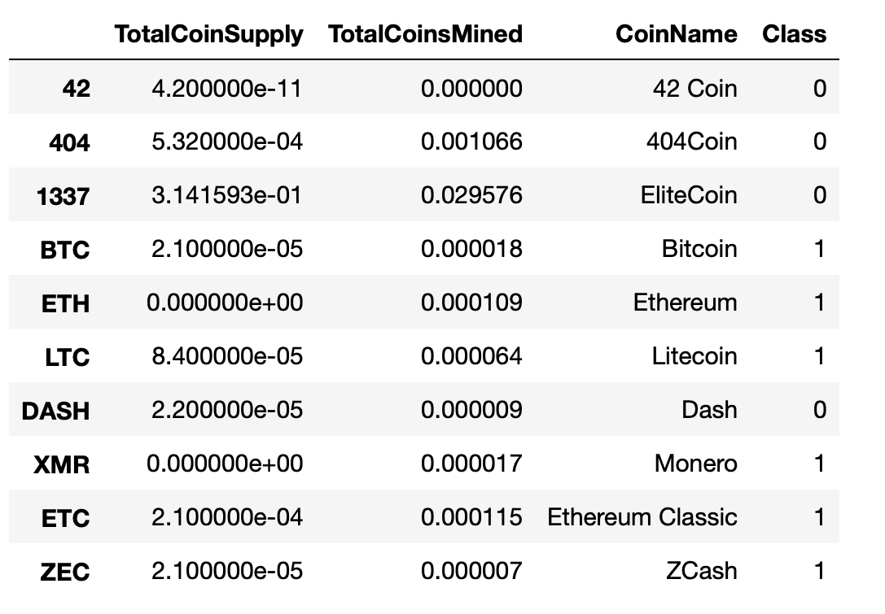

# Cyptocurrencies
UCB Challenge: Use skills associated with unsupervised learning to create an analysis for clients who are preparing to get into the cryptocurrency market.

# Overview of Analysis
Preprocess the database, reducing the data dimension using Principal Component Analysis or PCA, clustering cryptocurrencies using K-Means AND visualizing classification results with 2D and 3D scatter plots are skills associated with unsupervised learning; In this project we are given the task to analyze a database of cryptocurrencies using the skills mentioned above to create a report that includes what cryptocurrencies are on the trading market and how they could be grouped to create a classification system for this new investment.

## Preprocessing the Data for Principal Component Analysis or PCA
The original dataset had 1252 cryptocurrencies or rows and 6 columns, we were able to reduce this to 532 cryptocurrencies or rows and 4 columns. We were able to do this by removing rows with cryptocurrencies that were not being traded, rows that have at least one null and rows that do not have coins being mined. We took out or dropped the IsTrading column and the CoimName column. 

## Reducing Data Dimensions Using Principal Component Analysis or PCA
Principal Component Analysis or PCA was utilized to reduce the dimensions to three principal components; A new DataFrame that includes the following columns, PC 1, PC 2, and PC 3 was created.

## Clustering Cryptocurrencies Using K-means
Using the new DataFrame that was created, an elbow curve using hvPlot to find the best value for K was created using the K-Means method iterating on k values from 1 to 10. Based on the elbow curve, the best k value appears to be 4 so we would conclude on an output of 4 clusters to categorize the crytocurrencies. 

Another DataFrame that included predicted clusters and cryptocurrencies features was created. It has the following columns: Algorithm, ProofType, TotalCoinsMined, TotalCoinSupply, PC 1, PC 2, PC 3, CoinName, and Class. In this case, class would pertain correspond to the prediction, in terms of what cluster the cryptocurrency belongs to.

## Visualizing Cryptocurrencies Results

### 3D scatter plot with clusters

This 3-D scatter plot was obtained using the PCA algorithm to reduce the crytocurrencies dimensions to three principal components. 

### Tradable Cryptocurrencies Table

Most of the cryptocurrencies are part of class #0 and #1.
The snapshot above shows that BitTorrent is the only cryptocurrency in class #2. 

### Table for TotalCoinMined and TotalCoin Supply

Text here

### 2D-Scatter plot with TotalCoinMined vs TotalCoinSupply

Both these scatter plots show the distribution and the four clusters of cryptocurrencies.
We can identify the outliers like the unique cryptocurrency in the class #2. 

# Summary

